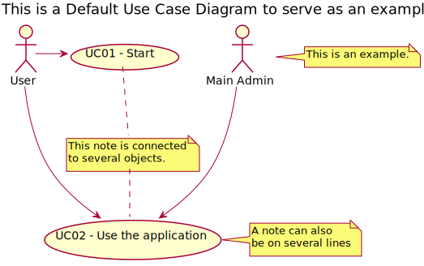

# Use Case Diagram (UCD)

**In the scope of this project, there is a direct relationship of _1 to 1_ between Use Cases (UC) and User Stories (US).**

However, be aware, this is a pedagogical simplification. On further projects and course units there may also exist _1 to N **and/or** N to 1_ relationships between UC and US.

**Insert below the Use Case Diagram in a SVG format.**

**For each UC/US, it must be provided evidences of applying main activities of the software development process (requirements, analysis, design, tests and code). Gather those evidences on a separate file for each UC/US and set up a link as suggested below.**

(Tip: organize the content of each US in a dedicated folder) 

# Use Cases / User Stories
| UC/US | Description                                                    |                   
|:------|:---------------------------------------------------------------|
| US01  | [Registar propriedade](US01/US01.md)                           |
| US02  | [Escolher ou atribuir agente](US02/US02.md)                    |
| US03  | [Publicar anúncio de imóvel](US01/US01.md)                     |
| US04  | [Consultar Propriedades Disponíveis](US99/US99.md)             
| US05  | [Marcar visita a uma propriedade](US01/US01.md)                |
| US06  | [Gerir pedidos de visita](US01/US01.md)                        |
| US07  | [Enviar pedido de compra/arrendamento](US01/US01.md)           |
| US08  | [Aprovar/Rejeitar pedido de Compra/Arrendamento](US01/US01.md) |
| US09  | [Registar Loja e Agentes](US01/US01.md)                        || US05  |
| US10  | [Gerir propriedades e Lojas](US01/US01.md)                     |
