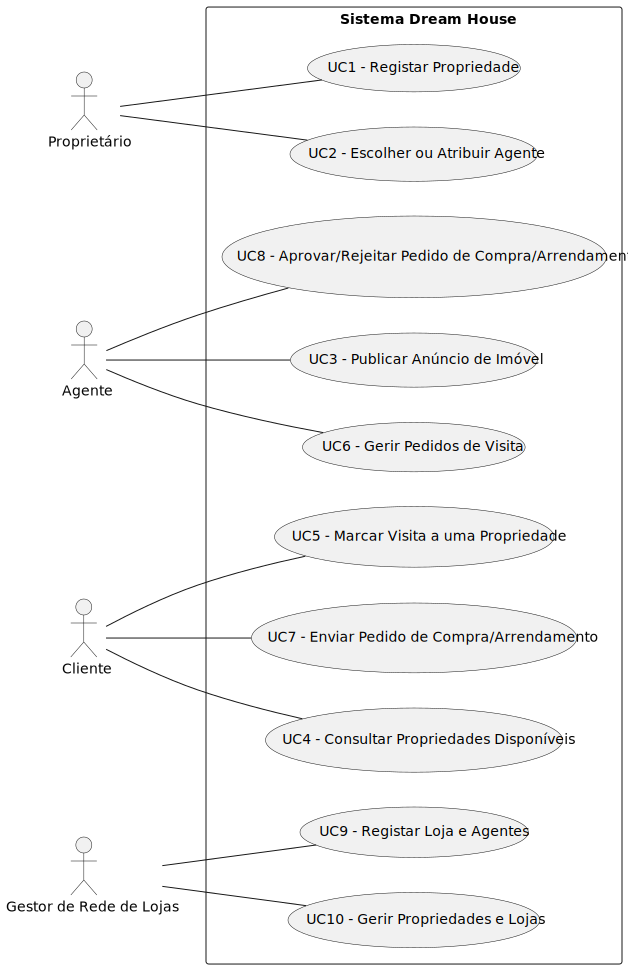

# Use Case Diagram (UCD)

| UC/US | Description                                                     |                   
|:------|:----------------------------------------------------------------|
| US01  | [Registar propriedade](US01/US01.md)                            |
| US02  | [Escolher ou atribuir agente](US02/US02.md)                     |
| US03  | [Publicar anúncio de imóvel](US01/US01.md)                      |
| US04  | [Consultar Propriedades Disponíveis](US99/US99.md)              
| US05  | [Marcar visita a uma propriedade](US01/US01.md)                 |
| US06  | [Gerir pedidos de visita](US01/US01.md)                         |
| US07  | [Enviar pedido de compra/arrendamento](US01/US01.md)            |
| US08  | [Aprovar/Rejeitar pedido de Compra/Arrendamento](US01/US01.md)  |
| US09  | [Registar Loja e Agentes](US01/US01.md)                         |
| US10  | [Gerir propriedades e Lojas](US01/US01.md)                      |
