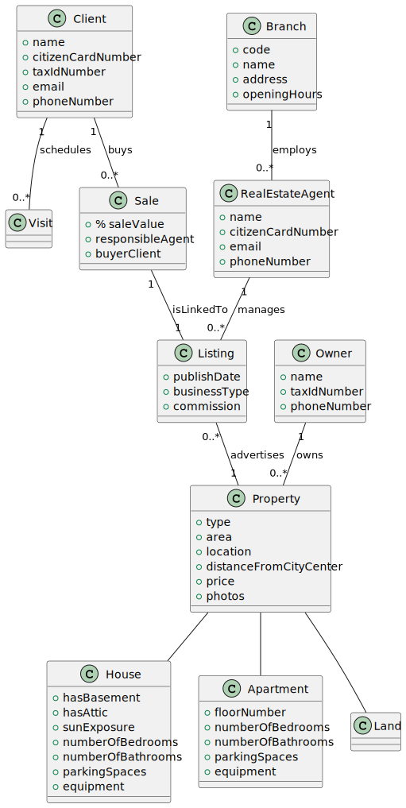

# OO Analysis

The construction process of the domain model is based on the client specifications, especially the nouns (for _concepts_) and verbs (for _relations_) used.

## Rationale to identify domain conceptual classes
To identify domain conceptual classes, start by making a list of candidate conceptual classes inspired by the list of categories suggested in the book "Applying UML and Patterns: An Introduction to Object-Oriented Analysis and Design and Iterative Development".

### _Conceptual Class Category List_

**Business Transactions**

- Classe: Listing

---

**Transaction Line Items**

-

---

**Product/Service related to a Transaction or Transaction Line Item**

- Classes: Proprety, House, Apartment, Land

---

**Transaction Records**

- Classes: Visit

---

**Roles of People or Organizations**

- Classes: Client, RealEstateAgent, Employee, Owner, Company

---

**Places**

- Classes: Branch, Property

---

**Noteworthy Events**

- Classes: Visit

---

**Physical Objects**

- Classes: Property, House, Apartment, Land

---

**Descriptions of Things**

- Classes: Property, Listing

---

**Catalogs**

- Classe: Listing

---

**Containers**

-

---

**Elements of Containers**

-

---

**Organizations**

- Classes: Company, Branch

---

**Other External/Collaborating Systems**

-

---

**Records of finance, work, contracts, legal matters**

- Classe: Listing

---

**Financial Instruments**

-

---

**Documents mentioned/used to perform some work**

-

---

## Rationale to identify associations between conceptual classes

| Concept (A) 		  |  Association   	   |   Concept (B)   |
|-----------------|:------------------:|:---------------:|
| Company  	      |        Owns        |     Branch      |
| Branch  	       |  Employs    		 	   | RealEstateAgent |
| Branch   	      |     Employs 	      |    Employee     |
| RealEstateAgent |  Handles    		 	   |      Sale       |
| RealEstateAgent |  Manages    		 	   |     Listing     |
| Client  	       | Schedules    		 	  |      Visit      |
| Client  	       |    Buys    		 	    |      Sale       |
| Sale  	         | isLinkedTo    		 	 |     Listing     |
| Owner  	        |    Owns    		 	    |    Property     |
| Listing  	      | Advertises    		 	 |    Property     |

## Domain Model

