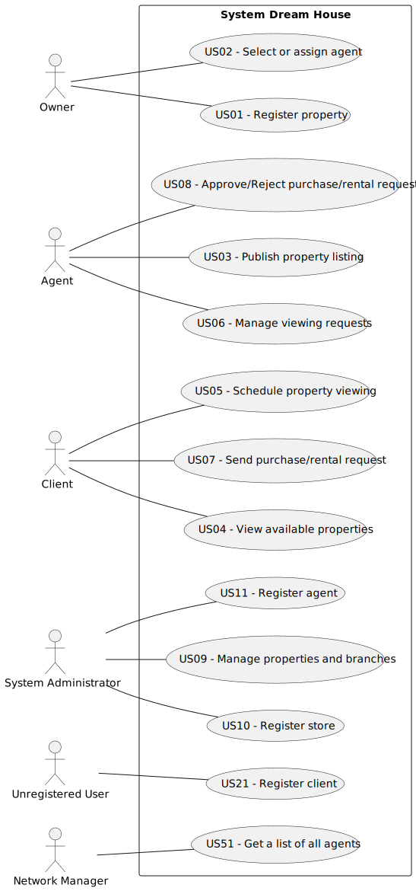

# Use Case Diagram (UCD)

| UC/US | Description                                            |                   
|:------|:-------------------------------------------------------|
| US01  | [Register property](US01/US01.md)                      |
| US02  | [Select or assign agent](US02/US02.md)                 |
| US03  | [Publish property listing](US01/US01.md)               |
| US04  | [View available properties](US99/US99.md)              
| US05  | [Schedule property viewing](US01/US01.md)              |
| US06  | [Manage viewing requests](US01/US01.md)                |
| US07  | [Send purchase/rental request](US01/US01.md)           |
| US08  | [Approve/Reject purchase/rental request](US01/US01.md) |
| US09  | [Manage properties and branches](US01/US01.md)         |
| US10  | [Register branch](US01/US01.md)                        |
| US11  | [Register agent](US01/US01.md)                         |
| US21  | [Register client](US01/US01.md)                        |
| US51  | [Get a list of all agents](US01/US01.md)               |
