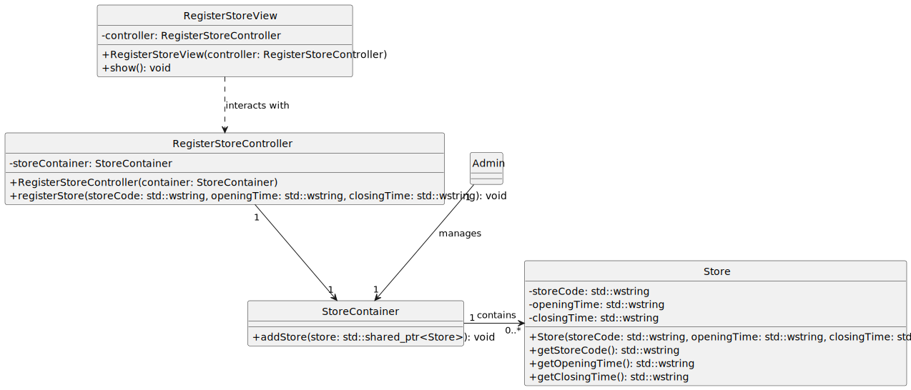

# US10 - Register a New Store

## 1. Requirements Engineering

### 1.1. User Story Description

As a System Administrator, I want to register a new store.

### 1.2. Customer Specifications and Clarifications

**From the specifications document:**

> When registering a store, a unique five-character alphanumeric code is required, along with the store's opening and closing times in the format hh:mm.

**From the client clarifications:**

> **Question:** Should there be validation to prevent overlap with existing stores’ codes?  
> **Answer:** Yes, the store code must be unique and should not match any existing store codes in the system.

### 1.3. Acceptance Criteria

- **AC10-1**: The store code must be unique and have exactly five alphanumeric characters.
- **AC10-2**: The store opening and closing times must be entered in the format hh:mm.

### 1.4. Found out Dependencies

- No dependencies were identified.

### 1.5 Input and Output Data

**Input Data:**

- Typed data:
    - A unique store code (5 alphanumeric characters)
    - Opening time (in hh:mm format)
    - Closing time (in hh:mm format)

**Output Data:**

- Success or failure message regarding the store registration.

### 1.6. System Sequence Diagram (SSD)

### 1.7 Other Relevant Remarks

- The store’s unique code is essential for identifying it in the system and preventing duplication.

## 2. OO Analysis

### 2.1. Relevant Domain Model Excerpt

### 2.2. Other Remarks

- n/a

## 3. Design - User Story Realization

### 3.1. Rationale

| Interaction ID | Question: Which class is responsible for... | Answer  | Justification (with patterns)  |
|:-------------  |:--------------------- |:------------|:---------------------------- |
| Step 1         | ... interacting with the actor? | RegisterStoreView   |  Pure Fabrication: this class is dedicated to handling user interactions for this operation.           |
|                | ... coordinating the US? | RegisterStoreController | Controller pattern, to manage the registration flow.                            |
|                | ... instantiating a new Store? | SystemAdmin   | Creator pattern: SystemAdmin oversees store management. |
|                | ... knows the StoreContainer? | SystemAdmin  | IE: SystemAdmin accesses StoreContainer to delegate responsibility for storing the new store. |
| Step 2         | ... requesting data?                  | RegisterStoreView  | IE: Interacts with the user to gather input. |
| Step 3         | ... saving the inputted data?         | Store  | IE: Store owns its data, ensuring internal data integrity. | 
|                | ... validating data (local validation)? | Store | IE: Store is responsible for validating its own data. |
|                | ... validating data (global validation)? | StoreContainer | IE: StoreContainer can check if a store code already exists. |
| Step 4         | ... confirming data and requesting validation? | RegisterStoreView | IE: Manages user interactions and prompts for validation. |
| Step 5         | ... saving the registered store?      | StoreContainer  | IE: Stores the validated and registered store. |
| Step 6         | ... informing operation success?      | RegisterStoreView  | IE: Reports back to the user on the operation's success or failure. |

### Systematization

According to the taken rationale, the conceptual classes promoted to software classes are:

- SystemAdmin
- Store

Other software classes (i.e., Pure Fabrication) identified:

- RegisterStoreView
- RegisterStoreController
- StoreContainer

### 3.2. Sequence Diagram (SD)

**Alternative 1**

### 3.3. Class Diagram (CD)

**Note:** Private methods were omitted for clarity.

## 4. Tests

Highlighted test scenarios:

**Test 1:** Verify that a store cannot be created with an invalid code length or non-alphanumeric characters.

      TEST_F(StoreFixture, CreateWithInvalidCode){
          EXPECT_THROW(new Store(L"123", L"09:00", L"18:00"), std::invalid_argument);
          EXPECT_THROW(new Store(L"ABCDE@", L"09:00", L"18:00"), std::invalid_argument);
      }

**Test 2:** Verify that a store cannot be created with an existing code.

      TEST_F(StoreFixture, CreateWithExistingCode){
          StoreContainer container;
          container.add(new Store(L"S0012", L"09:00", L"18:00"));
          EXPECT_THROW(container.add(new Store(L"S0012", L"10:00", L"19:00")), std::invalid_argument);
      }

**Test 3:** Verify that a store can be created with valid inputs.

      TEST_F(StoreFixture, CreateWithValidData){
          EXPECT_NO_THROW(new Store(L"S1234", L"09:00", L"18:00"));
      }

## 5. Integration and Demo

A menu option was added to the console application for store registration, triggering the `RegisterStoreView`.

      int StoresMenuView::processMenuOption(int option) {
          int result = 0;
          BaseView * view;
          switch (option) {
          
            case 1:
              view = new RegisterStoreView(this->userToken);
              view->show();
              break;
            ...
          }
          return result;
      }

## 6. Observations

- Consider additional validation for store operating hours (e.g., ensuring closing time is after opening time).
