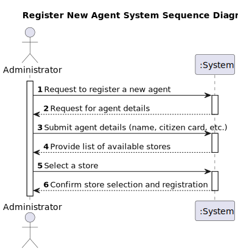
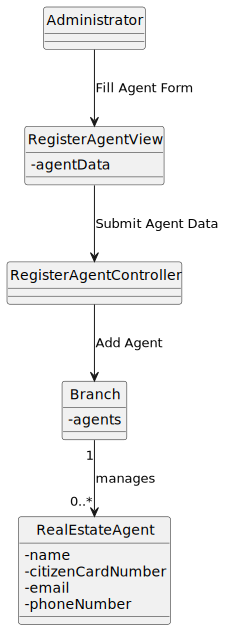
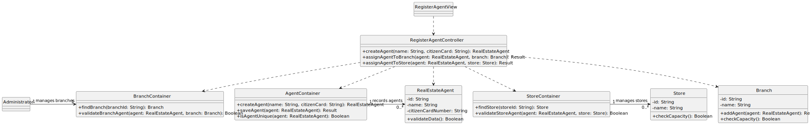

# US 11 - Register a new agent

## 1. Requirements Engineering

### 1.1. User Story Description

As System Administrator, I want to register a new agent.

### 1.2. Customer Specifications and Clarifications

**From the specifications document:**

> By simplicity, an agent must be associated with an existing branch, with all essential details (name, ID number, email, phone, etc.).

**From the client clarifications:**

> **Question:** ?
>
> **Answer:** *

### 1.3. Acceptance Criteria

- AC11-1: The Administrator should choose the store where the agent works (or will work) from a
  list of existing stores.
- AC11-2:  Providing the Citizen Card Number is optional.
### 1.4. Found out Dependencies

- US10

### 1.5 Input and Output Data

**Input Data:**

- Typed data:
    - Agent´s name
    - Phone number
    - Email
    - Id Number (optional)

- Selected data:
    - Branch where the agent will work

**Output Data:**

- (In)success of the operation

### 1.6. System Sequence Diagram (SSD)

### 1.7 Other Relevant Remarks

- The created category is ready to be used in task categorization.

## 2. OO Analysis

### 2.1. Relevant Domain Model Excerpt

### 2.2. Other Remarks

- The Branch class will be used to list and select the branch where the agent will work.

## 3. Design - User Story Realization

### 3.1. Rationale

| Interaction ID                    | Question: Which class is responsible for...                                         | Answer                  | Justification (with patterns)                                                                                                                                                                      |
|:----------------------------------|:------------------------------------------------------------------------------------|:------------------------|:---------------------------------------------------------------------------------------------------------------------------------------------------------------------------------------------------|
| Step 1  		                        | 	... interacting with the actor?                                                    | RegisterAgentView       | Pure Fabrication: Created to handle user interactions related to agent registration.                                                                                                               |
| 			  		                           | 	... coordinating the US?                                                           | RegisterAgentController | Controller: Manages and coordinates interactions for the agent registration process.                                                                                                               |
| 			  		                           | 	... instantiating a new agent?                                                     | AgentContainer          | Creator: The AgentContainer is responsible for creating and storing new RealEstateAgent instances.                                                                                                 |
| Step 2  		                        | 	... requesting agent information from the user?				                                | RegisterAgentView       | IE: This view is responsible for gathering the agent's details directly from the user interface.                                                                                                   |
| Step 3                            | ... requesting a list of stores?                                                    | RegisterAgentController | Controller: The RegisterAgentController requests the list of stores from the StoreContainer to provide options for the administrator to choose from.                                               |
|                                   | ... retrieving the list of available stores?                                        | StoreContainer          | Information Expert: The StoreContainer knows about all the stores and is responsible for retrieving and providing the store list to the RegisterAgentController.                                   |
|                                   | ... selecting a store for the agent?                                                | StoreSelectionView      | Information Expert: The StoreSelectionView displays the list of stores to the administrator, and upon selection, it passes the chosen store to the RegisterAgentController for further processing. |
| Step 4 		                         | 	... saving the inputted data?                                                      | AgentContainer          | IE: The AgentContainer manages all agents and can validate if the new agent is unique.                                                                                                             | 
| 		                                | 	... validating all data (local validation)?                                        | RealEstateAgent         | IE: Owns its data and should validate it.                                                                                                                                                          | 
| 			  	                            | 	... validating all data (global validation)?                                       | Branch                  | IE: Knows its agents and can verify valid assignments.                                                                                                                                             |
| Step 5  		                        | 	... finding and validating the branch where the agent will be assigned?            | BranchContainer         | IE: BranchContainer holds all branches and performs branch validation.                                                                                                                             |
| Step 6                            | ...assigning the agent to the selected branch?	                                     | Branch                  | High Cohesion and Low Coupling: Branch controls agent allocation and capacity without depending on other classes.                                                                                  |
|  Step 7                           | ...  assigning the agent to the selected store?                                     | Store                   |   High Cohesion and Low Coupling: Manages the assignment of agents while ensuring capacity and operational consistency.                                                                                                                                                                                                 |
| 		                                | 	... saving the new Agent?	                                                         | AgentContainer          | IE: The AgentContainer stores agents, so it is responsible for saving new instances.                                                                                                               |
| Step 8  		                        | 	... informing operation success?                                                   | RegisterAgentView       | Pure Fabrication: This view class is responsible for displaying operation results back to the user.                                                                                                | 

### Systematization

According to the taken rationale, the conceptual classes promoted to software classes are:

- RealEstateAgent
- Branch
- BranchContainer
- AgentContainer
- StoreContainer

Other software classes (i.e. Pure Fabrication) identified:

- RegisterAgentView
- RegisterAgentController

### 3.2. Sequence Diagram (SD)

**Alternative 1**

Can you enumerate any problems with this conceptual solution? 

**Alternative 2**

### 3.3. Class Diagram (CD)

## 4. Tests

Three relevant test scenarios are highlighted next.
Other test were also specified.

**Test 1:** Validating that an agent cannot be created with invalid data

      TEST_F(AgentFixture, CreateWithEmptyName) {
    EXPECT_THROW(new RealEstateAgent(L"", L"12345678"), std::invalid_argument);
    }

     TEST_F(AgentFixture, CreateWithInvalidCitizenCard) {
    EXPECT_THROW(new RealEstateAgent(L"Pedro Sousa", L"INVALID_CARD"), std::invalid_argument);
    }

**Test 2:** Verifying that an agent can be created with valid data

      TEST_F(AgentFixture, CreateWithValidData) {
    EXPECT_NO_THROW(new RealEstateAgent(L"Pedro Sousa", L"12345678"));
    }

**Test 3:** Assigning an agent to a store and saving the agent

      TEST_F(AgentContainerFixture, AddingAgentToStore) {
    EXPECT_TRUE(this->container->isEmpty());
    shared_ptr<RealEstateAgent> agent = this->container->create(L"John Doe", L"12345678");
    shared_ptr<Store> store = this->storeContainer->findStore(L"ST001");
    store->addAgent(agent);
    this->container->save(agent);
    EXPECT_FALSE(this->container->isEmpty());
    EXPECT_TRUE(store->hasAgent(agent));
    }

## 5. Integration and Demo

Two menu options on the console application were added. Such options invoke the RegisterAgentView and StoreSelectionView.

    int AgentMenuView::processMenuOption(int option) {
    int result = 0;
    BaseView *view;
    switch (option) {
        case 2: // Register a New Agent
            view = new RegisterAgentView(this->userToken);
            view->show();
            break;
        case 3: // Select Store for Agent
            view = new StoreSelectionView(this->userToken);
            view->show();
            break;
    }
    return result;
    }

## 6. Observations
- Store Selection: As per the acceptance criteria, the RegisterAgentController ensures that the Administrator selects a store from a list of available stores. This is facilitated by the StoreContainer, which manages all store instances.
- 

