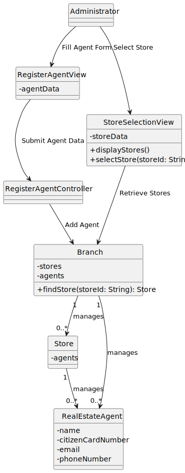
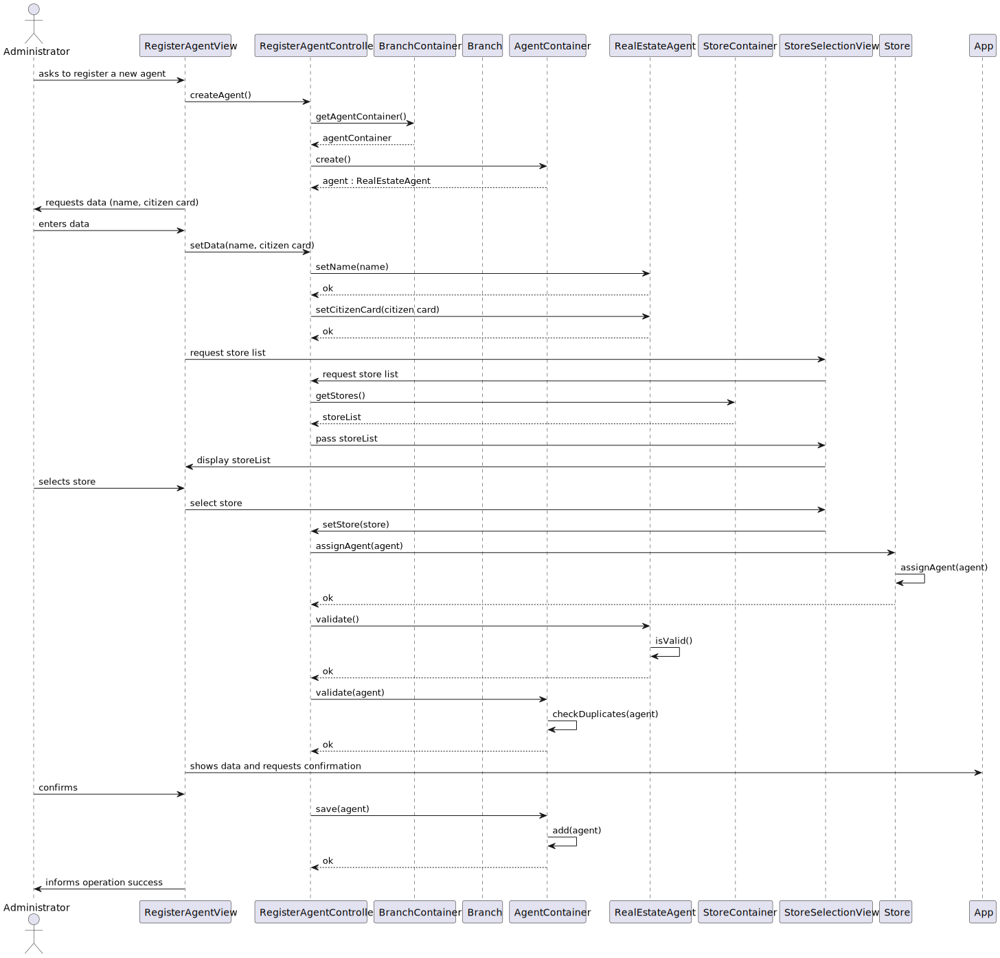
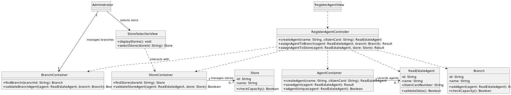

# US 11 - Register a new agent

## 1. Requirements Engineering

### 1.1. User Story Description

As System Administrator, I want to register a new agent.

### 1.2. Customer Specifications and Clarifications

**From the specifications document:**

> By simplicity, An agent must be associated with an existing branch, with all essential details (name, ID number, email, phone, etc.).

**From the client clarifications:**

> **Question:** ?
>
> **Answer:** *

### 1.3. Acceptance Criteria

- AC11-1: The Administrator should choose the store where the agent works (or will work) from a
  list of existing stores.
- AC11-2:  Providing the Citizen Card Number is optional.
### 1.4. Found out Dependencies

- No dependencies were found.

### 1.5 Input and Output Data

**Input Data:**

- Typed data:
    - Agent´s name
    - Phone number
    - Email
    - Id Number (optional)

- Selected data:
    - Branch where the agent will work

**Output Data:**

- (In)success of the operation

### 1.6. System Sequence Diagram (SSD)

### 1.7 Other Relevant Remarks

- The created category is ready to be used in task categorization.

## 2. OO Analysis

### 2.1. Relevant Domain Model Excerpt

### 2.2. Other Remarks

- The Branch class will be used to list and select the branch where the agent will work.

## 3. Design - User Story Realization

### 3.1. Rationale

| Interaction ID | Question: Which class is responsible for...                              | Answer                  | Justification (with patterns)                                                                                                    |
|:---------------|:-------------------------------------------------------------------------|:------------------------|:---------------------------------------------------------------------------------------------------------------------------------|
| Step 1  		     | 	... interacting with the actor?                                         | RegisterAgentView       | Pure Fabrication: class created to handle user interactions related to agent registration.                                       |
| 			  		        | 	... coordinating the US?                                                | RegisterAgentController | Controller: coordinates interactions for the agent registration process.                                                         |
| 			  		        | 	... instantiating a new agent?                                          | AgentContainer          | Creator: The AgentContainer is responsible for creating and storing new RealEstateAgent instances.                               |
| Step 2  		     | 	... requesting agent information from the user?				                     | RegisterAgentView       | IE: This view is responsible for gathering the agent's details directly from the user interface.                                 |
| Step 3  		     | 	... saving the inputted data?                                           | AgentContainer          | IE: The AgentContainer manages all agents and can validate if the new agent is unique.                                           | 
| 		             | 	... validating all data (local validation)?                             | RealEstateAgent         | IE: owns its data and should validate it.                                                                                        | 
| 			  	         | 	... validating all data (global validation)?                            | Branch                  | IE: knows its agents and can verify valid assignments.                                                                           |
| Step 4  		     | 	... finding and validating the branch where the agent will be assigned? | BranchContainer         | IE: BranchContainer holds all branches and performs branch validation.                                                                                       |
| Step 5         |  ...assigning the agent to the selected branch?	                         | Branch                  |    High Cohesion and Low Coupling: Branch controls agent allocation and capacity without depending on other classes.                                                                                                                              |
| Step 6 		      | 	... saving the new Agent?	                                              | AgentContainer          | IE: The AgentContainer stores agents, so it is responsible for saving new instances.                                              |
| Step 7  		     | 	... informing operation success?                                        | RegisterAgentView       | Pure Fabrication: This view class is responsible for displaying operation results back to the user.                              | 

### Systematization

According to the taken rationale, the conceptual classes promoted to software classes are:

- RealEstateAgent
- Branch

Other software classes (i.e. Pure Fabrication) identified:

- RegisterAgentView
- RegisterAgentController

### 3.2. Sequence Diagram (SD)

**Alternative 1**

Can you enumerate any problems with this conceptual solution? **Yes, several:**

- The Category object is created in an invalid state, which violates some of the best OO principles;
- Due to previous issue, "isValid" methods become, unnecessarily, required;
- Also, "set" methods are required.

**How to avoid such problems without modifying the spirit of the US flow previously defined?**

**Alternative 2**

**Notice that:**

- The US flow is kept;
- While creating a Category object, the constructor can check whether it is in a valid state or not. If not, it should fail;
- "isValid" method was avoided;
- "set" methods were completely avoided;
- OO best principles are being followed.

As a result, the conceptual solution become easier to understand and maintain.

**You should adopt this approach.**

### 3.3. Class Diagram (CD)

**Note: private methods were omitted.**

## 4. Tests

Three relevant test scenarios are highlighted next.
Other test were also specified.

**Test 1:** Check that it is not possible to create an instance of the Category class with invalid values.

      TEST_F(CategoryFixture, CreateWithEmptyCode){
          EXPECT_THROW(new Category(L"",L"Category One"),std::invalid_argument);
      }

      TEST_F(CategoryFixture, CreateWithCodeHavingFourChars){
          EXPECT_THROW(new Category(L"C001",L"Category One"),std::invalid_argument);
      }

**Test 2:** Check that it is possible to create an instance of the Category class with valid values.

      TEST_F(CategoryFixture, CreateWithValidData){
          EXPECT_NO_THROW(new Category(L"C0001",L"Category One"));
      }

**Test 3:** Check that it is possible create and add/save a category on the container.

      TEST_F(CategoryContainerFixture, AddingOneCategory){
          EXPECT_TRUE(this->container->isEmpty());
          shared_ptr<Category> cat = this->container->create(L"C0019", L"Category 19");
          this->container->save(cat);
          EXPECT_FALSE(this->container->isEmpty());
      }

## 5. Integration and Demo

A menu option on the console application was added. Such option invokes the CreateCategoryView.

      int AgentMenuView::processMenuOption(int option) {
          int result = 0;
          BaseView * view;
          switch (option) {
          
            case 1:
              view = new RegisterAgentView(this->userToken);
              view->show();
              break;
            ...
          }
          return result;
      }

## 6. Observations

