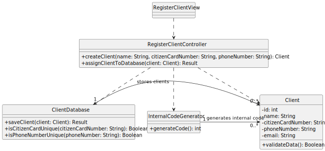

# US21 - Register a new client

## 1. Requirements Engineering

### 1.1. User Story Description

As Unregistered User, I want to register a new client.

### 1.2. Customer Specifications and Clarifications

**From the specifications document:**

> A client has a unique identification (Citizen Card Number), a phone number, and an internal code.

**From the client clarifications:**

> **Question:** What data does the system need for a new client?  
> **Answer:** The system requires the Citizen Card Number, phone number, name, and email.

### 1.3. Acceptance Criteria

- **AC21-1**: The Citizen Card Number and the phone number must be unique for each client.
- **AC21-2**: The Internal Code is a numeric code that starts at 1 and is generated sequentially.

### 1.4. Found out Dependencies

- No dependencies were found.

### 1.5 Input and Output Data

**Input Data:**

- Typed data:
  - Citizen Card Number
  - Phone number
  - Name
  - Email

**Output Data:**

- (In)success of the operation.

### 1.6. System Sequence Diagram (SSD)

### 1.7 Other Relevant Remarks

- The client is successfully registered with a unique Citizen Card Number and phone number, and an internal code is assigned sequentially.

---

## 2. OO Analysis

### 2.1. Relevant Domain Model Excerpt

### 2.2. Other Remarks

- The Client class stores details like name, citizenCardNumber, phoneNumber, and email.
- The ClientDatabase class is responsible for storing and verifying the uniqueness of the Citizen Card Number and Phone number.
- InternalCodeGenerator generates the unique internal code for each new client.

---

## 3. Design - User Story Realization

### 3.1. Rationale

| Interaction ID | Question: Which class is responsible for... | Answer  | Justification (with patterns)  |
|:-------------  |:--------------------- |:------------|:---------------------------- |
| Step 1  		 | ... interacting with the actor? | RegisterClientView   | Pure Fabrication: there is no reason to assign this responsibility to any existing class in the Domain Model.           |
| 			  		 | ... coordinating the US? | RegisterClientController | Controller                             |
| 			  		 | ... instantiating a new Client? | User   | Creator (Rule 1): the **User** initiates the process of creating a client. |
| 			  		 |	... checking the uniqueness of Citizen Card and Phone? | ClientDatabase   | ClientDatabase knows about the stored clients and can check for uniqueness. |
| Step 2  		 |	... requesting data?				  | RegisterClientView            | It is responsible for user interactions (getting client data). |
| Step 3  		 |	... saving the inputted data? | ClientDatabase  | ClientDatabase stores the validated client data. | 
|      		     |	... validating all data (local validation)? | Client | **Client** validates its own data (name, citizen card, etc.). |
| 			  	 |	... validating all data (global validation)? | ClientDatabase | **ClientDatabase** checks the uniqueness of the **Citizen Card** and **Phone Number**. |
| Step 4  		 |	... showing all data and request confirmation? | RegisterClientView            | It is responsible for showing the data to the user for confirmation. |
| Step 5  		 |	... saving the created client?	 | ClientDatabase  | **ClientDatabase** saves the validated client in the database. |
| Step 6  		 |	... informing operation success?| RegisterClientView  | It informs the user about the success of the operation. |

### Systematization

According to the taken rationale, the conceptual classes promoted to software classes are:

- Client
- ClientDatabase
- RegisterClientController
- RegisterClientView

Other software classes (i.e. Pure Fabrication) identified:

- RegisterClientController
- RegisterClientView

### 3.2. Sequence Diagram (SD)

### 3.3. Class Diagram (CD)

---

## 4. Tests

**Test 1:** Check that it is not possible to create a client with invalid Citizen Card Number or Phone number.

    TEST_F(ClientFixture, CreateWithDuplicateCitizenCard){
      EXPECT_THROW(new Client("John Doe", "12345678", "987654321"), std::invalid_argument);
    }

**Test 2:** Check that it is possible to create a client with valid details.

    TEST_F(ClientFixture, CreateWithValidData){
        EXPECT_NO_THROW(new Client("John Doe", "87654321", "123456789"));
    }

**Test 3:** Check that the client is saved properly in the database.

    TEST_F(ClientDatabaseFixture, AddingOneClient){
        EXPECT_TRUE(this->database->isEmpty());
        shared_ptr<Client> client = this->database->create("John Doe", "87654321", "123456789");
        this->database->save(client);
        EXPECT_FALSE(this->database->isEmpty());
    }
    

## 5. Integration and Demo 

A menu option on the console application was added. The option invokes the RegisterClientView. 

    int MenuView::processMenuOption(int option) {
        int result = 0;
        BaseView * view;
        switch (option) {
            case 1:
                view = new RegisterClientView(this->userToken);
                view->show();
                break;
            ...
            }
            return result;
    }
      

## 6. Observations

n/a