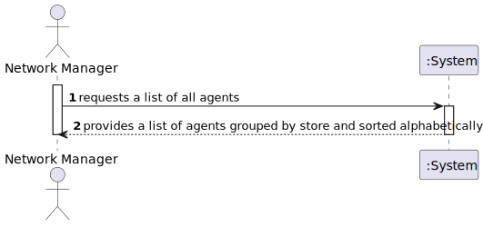
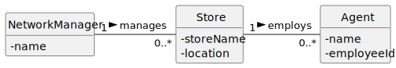
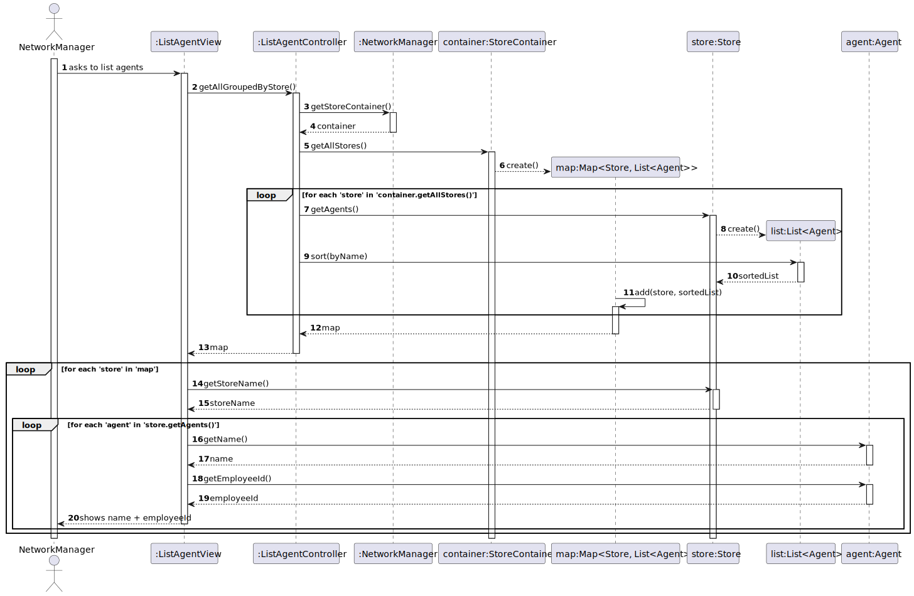
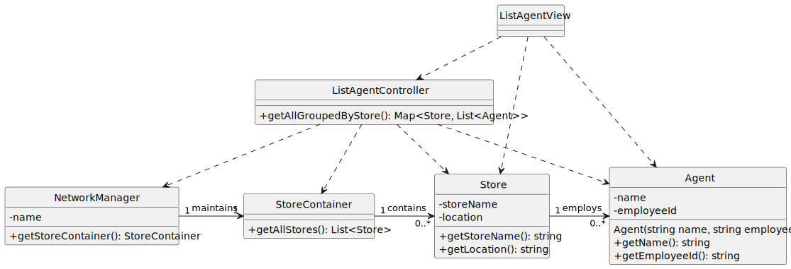

# US51 - List All Agents

## 1. Requirements Engineering

### 1.1. User Story Description

As a **Network Manager**, I want to get a list of all agents.

### 1.2. Customer Specifications and Clarifications

**From the specifications document:**

> The system should provide a comprehensive list of all agents grouped by store.

**From the client clarifications:**

> **Question:** Should agents be sorted or grouped in any specific way?  
> **Answer:** Yes, agents should be grouped by store, and within each store, listed alphabetically by name.

### 1.3. Acceptance Criteria

- **AC51-1**: The agents should be grouped by store and then listed alphabetically by name.

### 1.4. Found out Dependencies

- No dependencies were identified. However, agents and stores must be previously created in the system.

### 1.5. Input and Output Data

**Input Data:**

- Typed data:
  - n/a

- Selected data:
  - n/a

**Output Data:**

- A grouped and alphabetically sorted list of agents:
  - Grouped by store.
  - Alphabetical order by agent name within each store.

### 1.6. System Sequence Diagram (SSD)



### 1.7. Other Relevant Remarks

- Agents must already exist in the system.

---

## 2. OO Analysis

### 2.1. Relevant Domain Model Excerpt



### 2.2. Other Remarks

- Domain model must ensure agents are correctly associated with their respective stores.

---

## 3. Design - User Story Realization

### 3.1. Rationale

| Interaction ID | Question: Which class is responsible for... | Answer                | Justification (with patterns)       |  
|---------------- |------------------------------------------- |---------------------- |------------------------------------- |  
| Step 1          | ... interacting with the actor?           | ListAgentsView        | Pure Fabrication: handles user interactions for this use case. |  
| Step 2          | ... coordinating the use case?            | ListAgentsController  | Controller pattern to separate concerns. |  
| Step 3          | ... providing the list of agents grouped by store? | Store                | IE: Each store is responsible for managing its agents. |  
| Step 4          | ... formatting the output data for display? | ListAgentsView        | IE: Presents grouped and sorted data to the user. |  

### Systematization

According to the rationale, the conceptual classes promoted to software classes are:

- **Store**
- **Agent**

Other software classes (i.e., Pure Fabrication) identified:

- **ListAgentsView**
- **ListAgentsController**

### 3.2. Sequence Diagram (SD)



### 3.3. Class Diagram (CD)



---

## 4. Tests

### Highlighted Test Scenarios

**Test 1:** Retrieve agents when no stores exist.

```cpp
TEST_F(AgentManagementFixture, GetAgentsWhenNoStoresExist) {
    EXPECT_TRUE(this->storeManager->isEmpty());
    list<shared_ptr<Agent>> agents = this->storeManager->getAllAgents();
    EXPECT_TRUE(agents.empty());
}
```

**Test 2:** Retrieve agents grouped by store and sorted alphabetically.

```cpp
TEST_F(AgentManagementFixture, GetAgentsGroupedAndSorted) {
    this->populateStoresAndAgents();
    map<shared_ptr<Store>, list<shared_ptr<Agent>>> groupedAgents = this->storeManager->getAgentsByStore();
    EXPECT_TRUE(this->isGroupedCorrectly(groupedAgents));
    EXPECT_TRUE(this->isSortedAlphabetically(groupedAgents));
}
```

**Test 3:** Handle cases with only one agent per store.
```cpp
TEST_F(AgentManagementFixture, GetSingleAgentPerStore) {
this->addOneAgentPerStore();
map<shared_ptr<Store>, list<shared_ptr<Agent>>> groupedAgents = this->storeManager->getAgentsByStore();
EXPECT_EQ(groupedAgents.size(), this->getNumberOfStores());
EXPECT_TRUE(this->isGroupedCorrectly(groupedAgents));
}
```

---


## 5. Integration and Demo

### A menu option was added to the console application to trigger the agent listing feature.
```cpp
int AgentsMenuView::processMenuOption(int option) {
    int result = 0;
    BaseView *view;
    switch (option) {
        case 1:
            view = new ListAgentsView(this->userToken);
            view->show();
            break;
        default:
            result = -1;
            break;
    }
    return result;
}

```

## 6. Observations

### Additional tests may ensure agents without a store are not listed