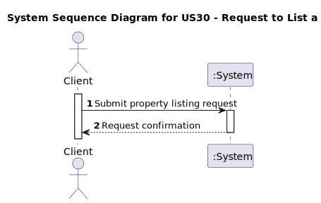
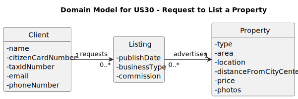
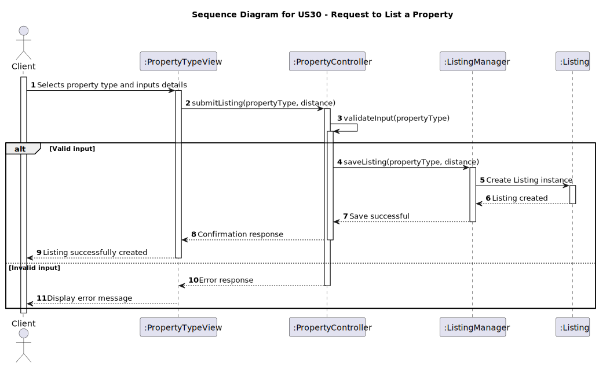
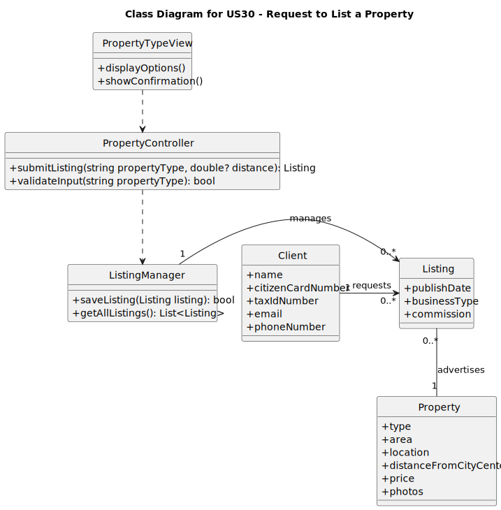

# US 30 - Request to List a Property for Sale or Rent

## 1. Requirements Engineering

### 1.1. User Story Description

As a client, I want to request to list a property for sale or rent.  
**Priority:** High.

### 1.2. Customer Specifications and Clarifications

- **Specification:**  
  The client must start by choosing the type of property to list: apartment, house, or land.  
  Distance from the city center can be optionally provided.

- **Clarification:**
    - The listing process should guide the client to select a property type before proceeding.
    - Additional property details should be inputted after selecting the type.

### 1.3. Acceptance Criteria

- **AC30-1:** The client should start by choosing the type of property to list (apartment, house, or land).
- **AC30-2:** Providing distance from the city center is optional.

### 1.4. Found out Dependencies

- Dependency on property type categories (apartment, house, land) defined in the domain model.
- Interaction with the property listing management system to save the listing.

### 1.5 Input and Output Data

- **Input Data:**
    - **Required:** Property type (apartment, house, land).
    - **Optional:** Distance from the city center.
    - **Additional Details (optional for later steps):** Address, size, price, rental or sale preference, etc.

- **Output Data:**
    - Confirmation message indicating successful listing submission.
    - Errors for incomplete or invalid input.

### 1.6. System Sequence Diagram (SSD)

**SSD Description:**  
The client interacts with the system to choose a property type, optionally provide distance from the city center, and submit the request.



### 1.7 Other Relevant Remarks

- **Special Requirements:**  
  Ensure the process is user-friendly with clear prompts for optional fields.
- **Technology Variations:**  
  Supports web and mobile interfaces.
- **Frequency:**  
  This user story may occur frequently as new clients list properties.

---

## 2. OO Analysis

### 2.1. Relevant Domain Model Excerpt

The domain model excerpt should include:
- **Entities:** Property, Client, Listing.
- **Attributes:** Type (Property), Distance from City Center, Listing ID.
- **Relationships:** A Client can have multiple Listings.



### 2.2. Other Remarks

- Include validations for required fields (property type).
- Provide tooltips or examples for optional fields (distance from the city center).

---

## 3. Design - User Story Realization

### 3.1. Rationale

| Interaction ID | Question: Which class is responsible for... | Answer              | Justification (with patterns)         |
|:---------------|:--------------------------------------------|:--------------------|:--------------------------------------|
| Step 1         | Displaying property type options?          | PropertyTypeView    | View manages user interaction.        |
| Step 2         | Capturing property details?                | PropertyController  | Controller validates and processes.   |
| Step 3         | Saving the property listing?               | ListingManager      | Manages persistence of data.          |
| Step 4         | Providing confirmation to the client?      | PropertyTypeView    | Ensures user feedback.                |

### Systematization

**Conceptual Classes Promoted to Software Classes:**
- Property
- Listing
- Client

**Other Software Classes Identified:**
- PropertyTypeView
- PropertyController
- ListingManager

### 3.2. Sequence Diagram (SD)

The sequence diagram illustrates the interactions between the client, view, controller, and backend systems to complete the property listing.



### 3.3. Class Diagram (CD)

The class diagram shows the software classes, their attributes, methods, and relationships relevant to this functionality.



---

## 4. Tests

**Test 1:** Verify that the client must select a property type before proceeding.

```java
@Test
public void testPropertyTypeSelection() {
    PropertyController controller = new PropertyController();
    assertThrows(InvalidInputException.class, () -> controller.submitListing(null));
}
```

---

**Test 2:** Verify optional distance input.
```java
@Test
public void testOptionalDistance() {
    PropertyController controller = new PropertyController();
    Listing listing = controller.submitListing("Apartment", null);
    assertNotNull(listing);
    assertNull(listing.getDistanceFromCityCenter());
}

```
## 5. Integration and Demo

This functionality integrates with:
- **Client Management Module:** Associates the listing with the client.
- **Listing Search Module:** Makes the listing visible for potential buyers/renters.

The demo will include listing a property via both web and mobile interfaces.

---

## 6. Observations

- **Alternatives:**  
  Allow more property types to be added dynamically.

- **Future Work:**  
  Enhance the listing process with location mapping and automated suggestions for prices based on market trends.
