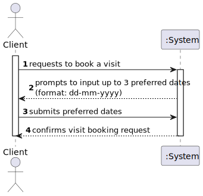

# US31 - Request Visit Booking

## 1. Requirements Engineering

### 1.1. User Story Description

As a **Client**, I want to request a visit booking.

---

### 1.2. Customer Specifications and Clarifications

**From the specifications document:**

> The system must allow a client to propose up to three preferred dates for a visit booking.  
> The client must provide each date in the format `dd-mm-yyyy` and time in the format `hh:mm`.

**From the client clarifications:**

> **Question:** 
> **Answer:** 
---

### 1.3. Acceptance Criteria

- **AC31-1:** Day and time should be entered in the format `dd-mm-yyyy` and `hh:mm`, respectively.
- **AC31-2:** A maximum of 3 preferred dates must be accepted.

---

### 1.4. Found out Dependencies

- No dependencies were found.

---

### 1.5 Input and Output Data

**Input Data:**

- Proposed Visit Date(s) (maximum 3):
  - Format: `dd-mm-yyyy` and `hh:mm`.

**Output Data:**

- Confirmation or request for correction (validation errors).

---

### 1.6. System Sequence Diagram (SSD)

---

### 1.7 Other Relevant Remarks

- The system must validate the date and time format before proceeding.
- Only clients who successfully submit valid dates and times will receive a booking confirmation.

---

## 2. OO Analysis

### 2.1. Relevant Domain Model Excerpt

---

### 2.2. Other Remarks

- The `VisitRequest` class is responsible for storing and validating the proposed visit dates.
- The `BookingSystem` class will handle the overall processing and interaction with the client.

---

## 3. Design - User Story Realization

### 3.1. Rationale

| Interaction ID                  | Question: Which class is responsible for...                           | Answer              | Justification (with patterns)                                       |
|---------------------------------|------------------------------------------------------------------------|---------------------|---------------------------------------------------------------------|
| Step 1  		                   | ... interacting with the actor?                                       | BookingView         | Pure Fabrication: Created to handle user interactions.              |
| 		                           | ... coordinating the US?                                              | BookingController   | Controller: Manages interactions and ensures data is processed.     |
| 		                           | ... validating the input data?                                        | VisitRequest        | Information Expert: Knows its data and is responsible for validation.|
| Step 2  		                   | ... confirming or rejecting the request?                              | BookingSystem       | Controller: Handles the logic for confirmations and notifications.  |

---

### Systematization

According to the taken rationale, the conceptual classes promoted to software classes are:

- **VisitRequest**
- **BookingSystem**

Other software classes (i.e., Pure Fabrication) identified:

- **BookingView**
- **BookingController**

---

### 3.2. Sequence Diagram (SD)

**Primary Flow**

---

### 3.3. Class Diagram (CD)

---

## 4. Tests

### Test 1: Validate Date and Time Format

- **Given**: A client submits a date in an invalid format.
- **When**: The system validates the input.
- **Then**: An error is returned.

---

### Test 2: Allow up to 3 Preferred Dates

- **Given**: A client submits three valid dates.
- **When**: The system processes the request.
- **Then**: The request is accepted.

---

## 5. Integration and Demo

- Menu options for booking requests were added, allowing clients to propose dates.
- The system prompts the client to correct input if validation fails.

---

## 6. Observations

- Ensure the system restricts clients from proposing more than three dates.
- Validation must be comprehensive to prevent invalid formats from being processed.  
