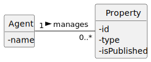

# US40 - Publish a Sale or Rent Advertisement

## 1. Requirements Engineering

### 1.1. User Story Description

As an Agent, I want to publish a sale or rent advertisement.

### 1.2. Customer Specifications and Clarifications

**From the specifications document:**

> The agent should be able to select one of their unpublished property listings and publish it as a sale or rent advertisement.

**From the client clarifications:**

> **Question:** ?  
> **Answer:** 

### 1.3. Acceptance Criteria

- **AC40-1:** The agent should choose the advertisement from a list of unpublished property listings assigned to him.

### 1.4. Found out Dependencies

- No dependencies were found.

### 1.5 Input and Output Data

**Input Data:**

- Selected data:
    - An unpublished property listing assigned to the agent.

**Output Data:**

- Confirmation of advertisement publication (success or failure).

### 1.6. System Sequence Diagram (SSD)

### 1.7 Other Relevant Remarks

- Only the assigned agent can publish the advertisement.

---

## 2. OO Analysis

### 2.1. Relevant Domain Model Excerpt

### 2.2. Other Remarks

- n/a

---

## 3. Design - User Story Realization

### 3.1. Rationale

Interaction ID | Question: Which class is responsible for... | Answer  | Justification (with patterns)  
|:-------------  |:--------------------- |:------------|:---------------------------- |  
| Step 1         | ... interacting with the actor?            | PublishAdView                | Pure Fabrication: there is no reason to assign this responsibility to any existing class in the Domain Model.  
|                | ... coordinating the US?                  | PublishAdController          | Controller: Coordinates the workflow and manages interactions between components.  
|                | ... fetching unpublished property listings? | PropertyContainer            | IE: Maintains and provides access to property listings.  
|                | ... knowing the PropertyContainer?        | Agent                        | IE: An Agent owns and interacts with their associated PropertyContainer.  
| Step 2         | ... retrieving the selected property listing? | PublishAdView               | IE: Responsible for user interactions and retrieving inputs.  
| Step 3         | ... modifying the publication status?     | Property                     | IE: The Property object owns and manages its data, ensuring encapsulation.  
| Step 4         | ... saving the updated property listing?  | PropertyContainer            | IE: Responsible for persisting changes to the property.  
| Step 5         | ... informing operation success?          | PublishAdView                | IE: Responsible for user interactions and feedback.  

### Systematization

According to the taken rationale, the conceptual classes promoted to software classes are:

- Agent
- Property

Other software classes (i.e., Pure Fabrication) identified:

- PublishAdView
- PublishAdController
- PropertyContainer

### 3.2. Sequence Diagram (SD)

### 3.3. Class Diagram (CD)

**Note: private methods were omitted.**

---

## 4. Tests

Three relevant test scenarios are highlighted next.  
Other tests were also specified.

**Test 1:** Check that it is not possible to publish an already published property listing.

      TEST_F(PropertyFixture, PublishAlreadyPublished){
          property->publish();
          EXPECT_THROW(property->publish(), std::logic_error);
      }

**Test 2:** Check that it is possible to publish an unpublished property listing.

      TEST_F(PropertyFixture, PublishUnpublishedListing){
          EXPECT_NO_THROW(property->publish());
          EXPECT_TRUE(property->isPublished());
      }

**Test 3:** Check that the published listing is saved in the container.

      TEST_F(PropertyContainerFixture, SavePublishedListing){
          shared_ptr<Property> prop = container->findById(L"P0001");
          prop->publish();
          container->save(prop);
          EXPECT_TRUE(container->findById(L"P0001")->isPublished());
      }

---

## 5. Integration and Demo

A menu option on the console application was added. Such option invokes the PublishAdView.

      int AdvertisementsMenuView::processMenuOption(int option) {
          int result = 0;
          BaseView * view;
          switch (option) {
          
            case 1:
              view = new PublishAdView(this->userToken);
              view->show();
              break;
            ...
          }
          return result;
      }

---

## 6. Observations

n/a
