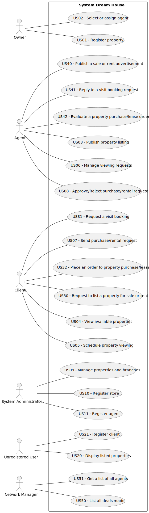

# Use Case Diagram (UCD)

| UC/US | Description                                                 |                   
|:------|:------------------------------------------------------------|
| US01  | [Register property](US01/US01.md)                           |
| US02  | [Select or assign agent](US02/US02.md)                      |
| US03  | [Publish property listing](US01/US01.md)                    |
| US04  | [View available properties](US99/US99.md)                   |
| US05  | [Schedule property viewing](US01/US01.md)                   |
| US06  | [Manage viewing requests](US01/US01.md)                     |
| US07  | [Send purchase/rental request](US01/US01.md)                |
| US08  | [Approve/Reject purchase/rental request](US01/US01.md)      |
| US09  | [Manage properties and branches](US01/US01.md)              |
| US10  | [Register branch](US10/US10.md)                             |
| US11  | [Register agent](US11/US11.md)                              |
| US21  | [Register client](US21/US21.md)                             |
| US51  | [Get a list of all agents](US51/US51.md)                    |
| US20  | [Display listed properties](US20/US20.md)                   |
| US30  | [Request to list a property for sale or rent](US30/US30.md) |
| US31  | [Request a visit booking](US31/US31.md)                     |
| US40  | [Publish a sale or rent advertisement](US40/US40.md)        |
| US32  | [Place an order to property purchase/lease](US32/US32.md)   |
| US41  | [Reply to a visit booking request](US41/US41.md)            |
| US42  | [Evaluate a property purchase/lease order](US42/US42.md)    |
| US50  | [List all deals made](US50/US50.md)                         |

