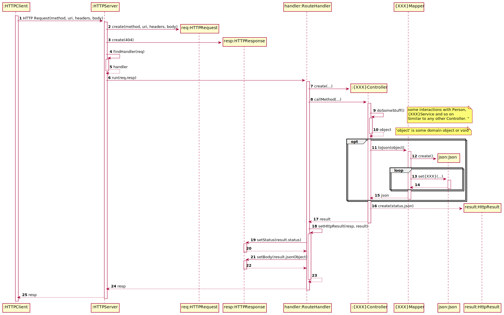

# Describing the Generic Flow in Any HTTP Request

## Sequence Diagram 

**This diagram depicts the flow (i.e. sequence of actions/steps) that any HTTP Request will follow.**

#### Some highlights/assumptions:

1. The **Controller** receives data/information extracted by the **RouteHandler** from the **HTTP Request**.
2. Any **Controller** method invoked returns an **HTTP Result** object.
3. A **HTTP Result** object states the proper **HTTP Status** to return and, optionally, a JSON object to include in the **HTTP Response**.
4. The **Route Handler** updates the **HTTP Response** in accordance with the **HTTP Result** returned by the **Controller**.

Accordingly, the controllers are not dependent on the HTTP library (**httplib.h**) adopted to handle the communications.
However, the Controller still depends on the adopted JSON library (**json.hpp**).
On the contrary, the other objects (i.e. HTTPServer, HTTPRequest, HTTPResponse and RouteHandler) are dependent on the adopted HTTP library.