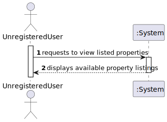
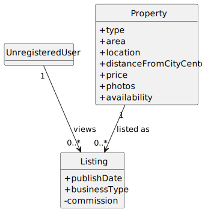
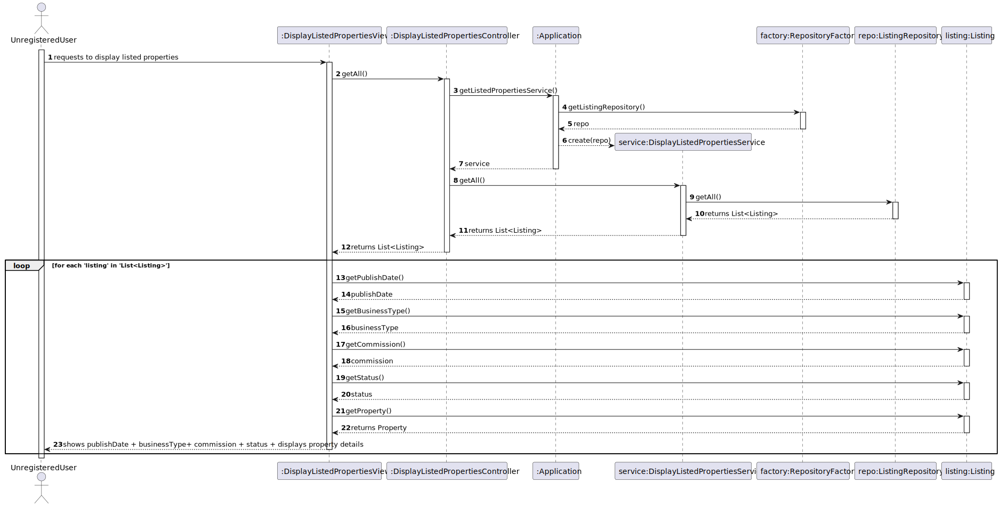
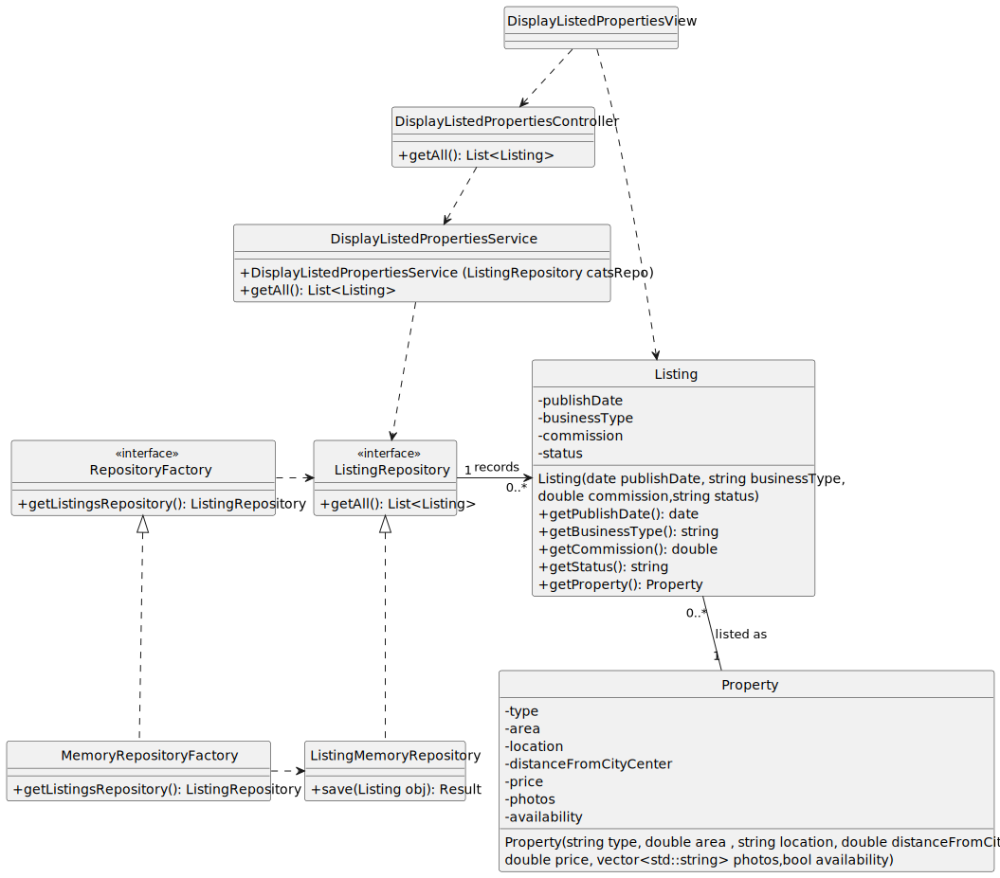

# US 20 - Display listed properties

## 1. Requirements Engineering

### 1.1. User Story Description

As Unregistered User, I want to display listed properties.

### 1.2. Customer Specifications and Clarifications

**From the specifications document:**

> By simplicity, listed properties should be accessible to unregistered users without requiring them to be associated with a specific agent
**From the client clarifications:**

> **Question:** ?
>
> **Answer:** *

### 1.3. Acceptance Criteria

- None

### 1.4. Found out Dependencies

- No dependencies were found.

### 1.5 Input and Output Data

**Input Data:**

**Output Data:**
- List of properties 
- (In)success of the operation

### 1.6. System Sequence Diagram (SSD)

### 1.7 Other Relevant Remarks

- The displayed list of properties is intended for unregistered users, meaning sensitive information (e.g., owner details, agent contact information) will not be displayed.
- The system should allow unregistered users to browse properties but restrict actions like booking visits or requesting additional details unless the user registers.

## 2. OO Analysis

### 2.1. Relevant Domain Model Excerpt

### 2.2. Other Remarks

- The Listing class will be used to retrieve and display property details such as type, price, and availability.
- The Property class will provide additional information, such as location and photos.

## 3. Design - User Story Realization

### 3.1. Rationale

| Interaction ID | Question: Which class is responsible for...                                                                                                                                                                           | Answer                             | Justification (with patterns)                                                                                                                                                                                                                                    |
|:---------------|:----------------------------------------------------------------------------------------------------------------------------------------------------------------------------------------------------------------------|:-----------------------------------|:-----------------------------------------------------------------------------------------------------------------------------------------------------------------------------------------------------------------------------------------------------------------|
| Step 1  		     | 	... interacting with the actor?                                                                                                                                                                                      | DisplayListedPropertiesView        | Pure Fabrication: Created to directly handle user interactions related to displaying property listings.                                                                                                                                                          |
| 			  		        | 	... coordinating the US?                                                                                                                                                                                             | DisplayListedPropertiesController	 | Controller: Manages and coordinates all interactions required for the use case of displaying and filtering listed properties.                                                                                                                                    |
| 			  		        | ... retrieving the list of properties?                                                                                                                                                                                | DisplayListedPropertiesService     | Information Expert: Responsible for accessing and organizing property data by querying the listing repository.                                                                                                                                                   |                                                                                    |
| Step 2  		     | 	... requesting available property listings from storage?				                                                                                                                                                         | ListingRepository                  | Information Expert: Stores all properties and is responsible for efficiently retrieving listings.                                                                                                                                                                |                                                                                                |
| Step 3         | ... displaying the list of properties to the user?                                                                                                                                                                    | DisplayListedPropertiesView        | Pure Fabrication: Designed to render and display the available listings to the user based on data provided by the Controller.                                                                                                                                    |
|                | ... ensuring repository availability?                                                                                                                                                                                 | RepositoryFactory                                   |Pure Fabrication: Abstracts the creation and provision of the repository instance, enabling flexibility in choosing the repository type (e.g., in-memory, database).                                                                                                                                                                                                                                                                  |
| Step 4         | ... encapsulating listing details like publish date, business type, and status?                                                                                                                                       | Listing                            | Information Expert: Contains and provides access to listing-specific data and its associated property, ensuring proper encapsulation.                                                                                                                            |

### Systematization

According to the taken rationale, the conceptual classes promoted to software classes are:

- Property
- Listing
- ListingRepository

Other software classes (i.e. Pure Fabrication) identified:

- DisplayListedPropertiesView
- DisplayListedPropertiesController
- DisplayListedPropertiesService
- RepositoryFactory

### 3.2. Sequence Diagram (SD)

### 3.3. Class Diagram (CD)

## 4. Tests

## 5. Integration and Demo

## 6. Observations
- Store Selection: As per the acceptance criteria, the RegisterAgentController ensures that the Administrator selects a store from a list of available stores. This is facilitated by the StoreContainer, which manages all store instances.
- 

