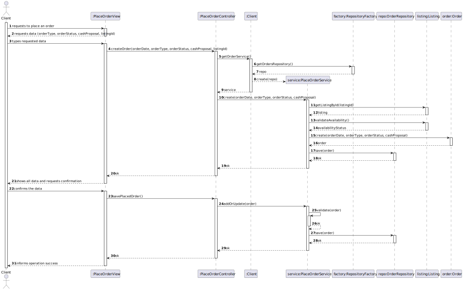
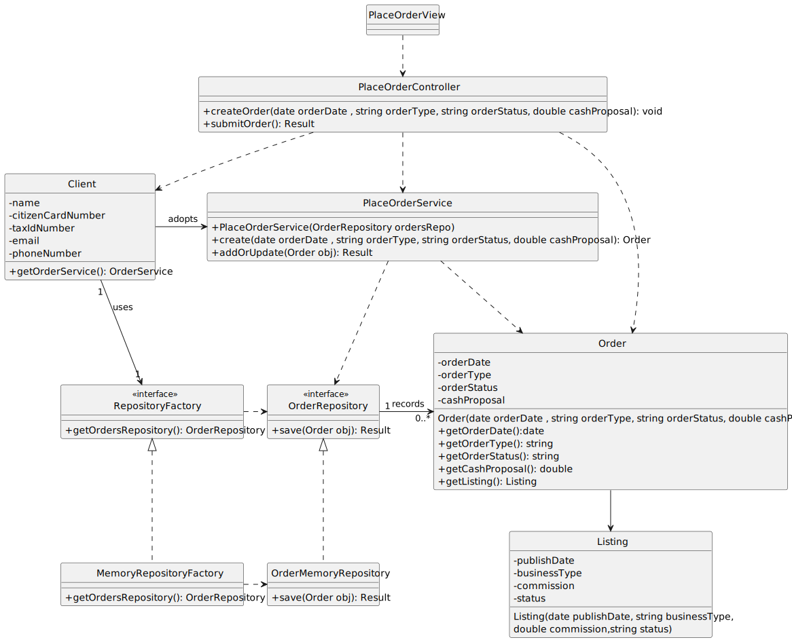

# US 32 - To place an order to property purchase/lease

## 1. Requirements Engineering

### 1.1. User Story Description

As Client , I want to place an order to property purchase/lease

### 1.2. Customer Specifications and Clarifications 

**From the specifications document:**

> By simplicity, a order comprehends a date, type,status,a cash proposal and is associated with a listing.

**From the client clarifications:**

> **Question:** ?
>
> **Answer:** *

### 1.3. Acceptance Criteria

### 1.4. Found out Dependencies

- No dependencies were found.

### 1.5 Input and Output Data

**Input Data:**

- Typed data:
    - a code
    - a description

- Selected data:
    - n/a

**Output Data:**

- (In)success of the operation

### 1.6. System Sequence Diagram (SSD)

### 1.7 Other Relevant Remarks

- The created category is ready to be used in task categorization.

## 2. OO Analysis

### 2.1. Relevant Domain Model Excerpt 

### 2.2. Other Remarks

- n/a

## 3. Design - User Story Realization

### 3.1. Rationale

| Interaction ID | Question: Which class is responsible for...                                                                               | Answer               | Justification (with patterns)                                                                         |
|:---------------|:--------------------------------------------------------------------------------------------------------------------------|:---------------------|:------------------------------------------------------------------------------------------------------|
| Step 1  		     | 	... interacting with the actor?                                                                                          | PlaceOrderView       | Pure Fabrication: Created specifically to handle user interactions related to placing an order.       |
| 			  	         | 	... coordinating the US?                                                                                                 | PlaceOrderController | Controller: Manages and coordinates the flow of information and actions required for order placement. |
| 			  		        | 	... retrieving the service?                                                                                              | Client               | Pure Fabrication: Manages service instantiation and repository interaction for the use case.               |
| Step 2  		     | 	... providing the list of available properties for the order?			                                                         | OrderService         | Information Expert: Responsible for accessing the listing associated with the order.                           |
| Step 3  		     | 	... retrieving the repository?                                                                                           | RepositoryFactory    | Pure Fabrication: Encapsulates repository creation to ensure flexibility and maintainability.         | 
|                | ... persisting the order?                                                                                                 | OrderRepository      |  Pure Fabrication: Abstracts the persistence logic, allowing different implementations (e.g., memory, database) without affecting business logic.                                                                                                     |
| 		             | 	... accessing and validating property data?                                                                              | Listing              | Information Expert: Knows its availability and status, ensuring accurate validation.                                                                                   | 
| Step 4  		     | 	.. creating and saving the order?                                                                                        | OrderService         | Creator: Handles the creation of the Order object and its persistence through the repository.                                                            |
| Step 5  		     | 	... validating the order details?                                                                                        | Order                | Information Expert: Encapsulates its data and is responsible for its own validation.                                                                 |
| Step 6  		     | 	... informing the client of operation success?                                                                           | PlaceOrderView       | Pure Fabrication: Displays the operation success to the client, ensuring separation of concerns.                                                          | 

### Systematization

According to the taken rationale, the conceptual classes promoted to software classes are: 

- Client
- Listing
- Order

Other software classes (i.e. Pure Fabrication) identified:

- PlaceOrderView
- PlaceOrderController
- OrderService
- OrderRepository
- RepositoryFactory

### 3.2. Sequence Diagram (SD)

### 3.3. Class Diagram (CD)

Class diagram as resulting from the above sequence diagram and rationale:

## 4. Tests

Three relevant test scenarios are highlighted next.
Other test were also specified.

**Test 1:** Check that it is not possible to create an instance of the Category class with invalid values. 

      TEST_F(CategoryFixture, CreateWithEmptyCode){
          EXPECT_THROW(new Category(L"",L"Category One"),std::invalid_argument);
      }

      TEST_F(CategoryFixture, CreateWithCodeHavingFourChars){
          EXPECT_THROW(new Category(L"C001",L"Category One"),std::invalid_argument);
      }

**Test 2:** Check that it is possible to create an instance of the Category class with valid values.

      TEST_F(CategoryFixture, CreateWithValidData){
          EXPECT_NO_THROW(new Category(L"C0001",L"Category One"));
      }

**Test 3:** Check that it is possible create and add/save a category on the CategoryMemoryRepository.
    
      TEST_F(CategoryMemoryRepositoryFixture, AddingOneCategory){
          EXPECT_TRUE(this->repo->isEmpty());
          shared_ptr<Category> cat = make_shared<Category>(L"C0019", L"Category 19");
          this->repo->save(cat);
          EXPECT_FALSE(this->repo->isEmpty());
      }
    

## 5. Integration and Demo 

A menu option on the console application was added. Such option invokes the CreateCategoryView.

      int CategoriesMenuView::processMenuOption(int option) {
          int result = 0;
          BaseView * view;
          switch (option) {
          
            case 1:
              view = new CreateCategoryView(this->userToken);
              view->show();
              break;
            ...
          }
          return result;
      }
      

## 6. Observations

n/a