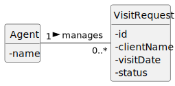

# US 41 - To reply to a visit booking request

## 1. Requirements Engineering

### 1.1. User Story Description

As an Agent, I want to reply to a visit booking request.

### 1.2. Customer Specifications and Clarifications

**From the specifications document:**

> Agents should be able to reply to unanswered visit booking requests assigned to them.

**From the client clarifications:**

> **Question:** ?
>
> **Answer:** *

### 1.3. Acceptance Criteria

- AC41-1: The agent should choose the visit booking request from a list of unanswered requests assigned to him.

### 1.4. Found out Dependencies

- No dependencies were found.

### 1.5 Input and Output Data

**Input Data:**

- Typed data:
    - A response (e.g., "Accepted" or "Declined").

- Selected data:
    - An unanswered visit booking request.

**Output Data:**

- (In)success of the operation

### 1.6. System Sequence Diagram (SSD)

### 1.7 Other Relevant Remarks

- Responses are limited to predefined options (e.g., "Accepted" or "Declined").

## 2. OO Analysis

### 2.1. Relevant Domain Model Excerpt

### 2.2. Other Remarks

- n/a

## 3. Design - User Story Realization

### 3.1. Rationale

- n/a

### Systematization

According to the taken rationale, the conceptual classes promoted to software classes are:

- Agent
- VisitRequest

Other software classes (i.e. Pure Fabrication) identified:

- ReplyBookingRequestView
- ReplyBookingRequestController
- BookingRequestService
- BookingRequestRepository
- RepositoryFactory

### 3.2. Sequence Diagram (SD)

#### 3.2.1. Previous Perspective (using Controllers for a Console UI)

**Notice that:**

- The interaction follows the repository and service patterns to handle visit requests.
- The RepositoryFactory ensures consistent use of the same persistence mechanism.

#### 3.2.2. REST API Perspective (reusing the domain logic)

**This SD follows the Generic Flow in Any HTTP Request defined [here](../HTTPFlow/HTTPFlow.md).**

### 3.3. Class Diagram (CD)

#### 3.3.1. Previous Perspective (using Controllers for a Console UI)

#### 3.3.2. REST API Perspective (reusing the domain logic)

## 4. Tests

Three relevant test scenarios are highlighted next.
Other tests were also specified.

**Test 1:** Check that an agent can only reply to requests assigned to them.

      TEST_F(BookingRequestServiceFixture, ReplyToUnassignedRequest){
          EXPECT_THROW(service.replyToRequest(unassignedRequest, "Accepted"), std::logic_error);
      }

**Test 2:** Check that it is possible to reply to a valid request.

      TEST_F(BookingRequestServiceFixture, ReplyToAssignedRequest){
          EXPECT_NO_THROW(service.replyToRequest(validRequest, "Accepted"));
      }

**Test 3:** Check that the request status is updated after a reply.

      TEST_F(BookingRequestRepositoryFixture, SaveReplyUpdatesStatus){
          service.replyToRequest(validRequest, "Declined");
          EXPECT_EQ(validRequest.getStatus(), "Declined");
      }

## 5. Integration and Demo

A menu option on the console application was added. Such option invokes the ReplyBookingRequestView.

      int BookingRequestsMenuView::processMenuOption(int option) {
          int result = 0;
          BaseView * view;
          switch (option) {
          
            case 1:
              view = new ReplyBookingRequestView(this->userToken);
              view->show();
              break;
            ...
          }
          return result;
      }

## 6. Observations

n/a
