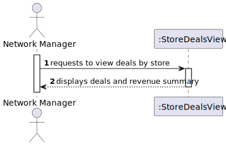
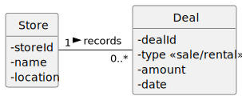
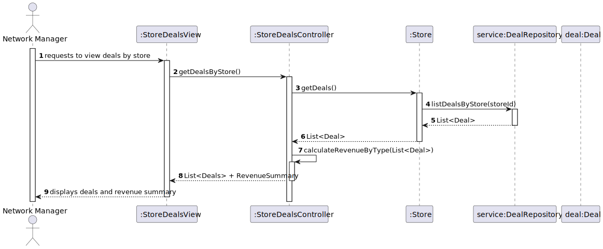
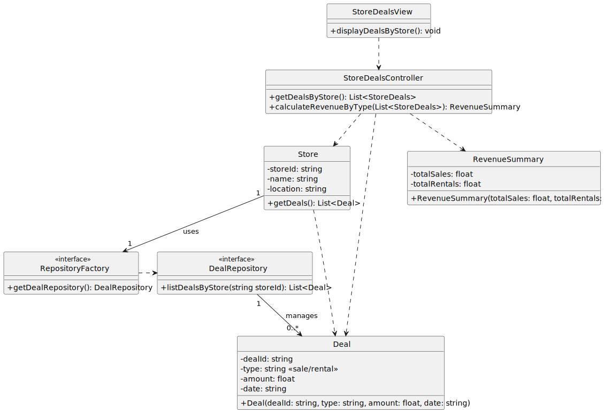

# US 50 - To list all deals made

## 1. Requirements Engineering

### 1.1. User Story Description

As a Network Manager, I want to list all deals made.

### 1.2. Customer Specifications and Clarifications

**From the specifications document:**

> The deals made should be listed store by store, and the total revenue per store must be displayed, separated by type of business (sales and rentals).

**From the client clarifications:**

> **Question:** Should the deals include only completed ones, or should pending deals also be listed?  
> **Answer:** Only completed deals should be included in the list.

> **Question:** Should the revenue calculation include taxes?  
> **Answer:** No, revenue should be displayed before taxes.

### 1.3. Acceptance Criteria

- AC50-1: The deals made should be listed store by store, and the total revenue per store must be displayed, separated by type of business (sales and rentals).

### 1.4. Found out Dependencies

- Data regarding deals and revenue must be available in the system's database.
- Stores must have unique identifiers to group their respective deals.

### 1.5 Input and Output Data

**Input Data:**

- No direct user input required.
- System retrieves:
  - All completed deals from the database.
  - Store identifiers and relevant metadata.

**Output Data:**

- A list of stores:
  - Each store's completed deals, grouped by type (sales or rentals).
  - Total revenue per store for each type of business.

### 1.6. System Sequence Diagram (SSD)

### 1.7 Other Relevant Remarks

- The list must be sortable (e.g., by store name or revenue totals).
- Pagination should be considered if the number of deals is large.

---

## 2. OO Analysis

### 2.1. Relevant Domain Model Excerpt

### 2.2. Other Remarks

- Each deal must be associated with one store.
- Deals are categorized as "sales" or "rentals."

---

## 3. Design - User Story Realization

### 3.1. Rationale

- The design must ensure that stores and deals are correctly linked, and revenue calculations are accurate.

### Systematization

According to the taken rationale, the conceptual classes promoted to software classes are:

- Store
- Deal

Other software classes (i.e., Pure Fabrication) identified:

- StoreDealsView
- StoreDealsController
- DealRepository
- RevenueCalculator

### 3.2. Sequence Diagram (SD)

#### 3.2.1. Console/UI Perspective

**Notice that:**

- The system retrieves completed deals from the repository and groups them by store.
- A revenue calculator is used to summarize total revenue per store for each type of business.

#### 3.2.2. REST API Perspective

**This SD follows the Generic Flow in Any HTTP Request defined [here](../HTTPFlow/HTTPFlow.md).**

---

### 3.3. Class Diagram (CD)

#### 3.3.1. Console/UI Perspective

#### 3.3.2. REST API Perspective

---

## 4. Tests

Three relevant test scenarios are highlighted next. Other tests were also specified.

**Test 1:** Check that only completed deals are listed.

    TEST_F(DealRepositoryFixture, ListCompletedDeals){
        auto deals = repo.listCompletedDeals();
        for (const auto& deal : deals) {
            EXPECT_EQ(deal.getStatus(), "Completed");
        }
    }

**Test 2:** Check that deals are correctly grouped by store.

    TEST_F(RevenueCalculatorFixture, GroupDealsByStore){
        auto summary = calculator.calculateRevenue(deals);
        EXPECT_EQ(summary["Store1"].totalSales, 5000);
        EXPECT_EQ(summary["Store1"].totalRentals, 2000);
    }

**Test 3:** Check that revenue calculation is accurate.

    TEST_F(RevenueCalculatorFixture, CalculateRevenue){
        auto revenue = calculator.calculateRevenueForStore(deals);
        EXPECT_EQ(revenue.sales, 7000);
        EXPECT_EQ(revenue.rentals, 3000);
    }

## 5. Integration and Demo

A menu option on the console application was added. Such option invokes the StoreDealsView.

    int DealsMenuView::processMenuOption(int option) {
        int result = 0;
        BaseView * view;
        switch (option) {
        
          case 1:
            view = new StoreDealsView();
            view->show();
            break;
          ...
        }
        return result;
    }

## 6. Observations